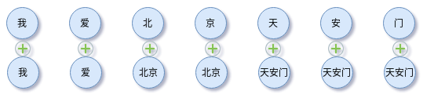

# word-char-hybrid-embedding


提供一种以字为基准对齐的字词混合Embedding。


例如，“我爱北京天安门”，有

```text
text：我爱北京天安门
分词：['我', '爱', '北京', '天安门']
字ID：[2 3 4 5 6 7 8]
词ID：[2 3 37 37 38 38 38]
段ID：[1 2 3 3 4 4 4]
```

'天安门'的在词表中的ID为38，由于`len('天安门')=3`，因此词ID拓展成`[38 38 38]`，在句子中对应的段ID为`[4 4 4]`。如下示意图，



整个句子依照这种方法组合在一起。组合方法可以是Add或Concat。其中Add方法叠加后需要scaling以保障数值在原来的区间上。

更详细原理可阅读源码。

经过测试，HybridEmbedding稳定地提升1%+，且收敛更快。
